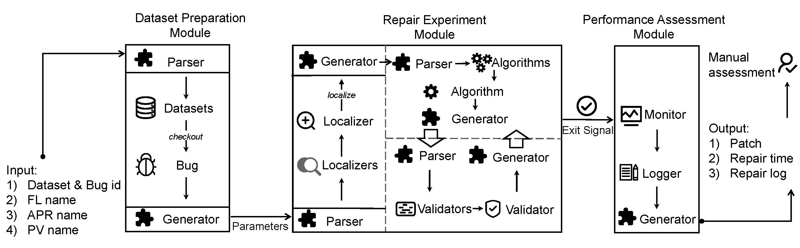

# APRConfig: Make Every APR Module Configurable

- [APRConfig: Make Every APR Module Configurable](#aprconfig-make-every-apr-module-configurable)
  - [1. Introduction](#1-introduction)
  - [2. APRConfig Framework](#2-aprconfig-framework)
  - [3. Usage](#3-usage)
  - [4. Reproduction](#4-reproduction)
    - [4.2. Preparation](#42-preparation)
    - [4.3. Run APRConfig](#43-run-aprconfig)
    - [4.4. Parse Results of APRConfig](#44-parse-results-of-aprconfig)
    - [4.5. To Plot Statistics](#45-to-plot-statistics)
  - [5. Structure](#5-structure)
  - [6. APRConfig Extension](#6-aprconfig-extension)
  - [7. Acknowledgment](#7-acknowledgment)
  - [8. LICENSE](#8-license)

This is a repository for TOSEM'22 paper "Seeing the Whole Elephant: Systematically Understanding and Uncovering Evaluation Biases in Automated Program Repair".

## 1. Introduction

Bias in APR evaluation which could result in serious consequences (i.e., incorrect conclusions) is an important issue for the APR community. One representative fact is that the bias study has been performed along with the pioneer APR techniques and has become increasingly popular in recent years. However, the bias in APR evaluation is still not resolved yet. Specifically, there are three major challenges:

1. Uncovered bias understanding: since the first proposal of the APR technique, how many biases have been uncovered? what about their corresponding impact on APR evaluation? and are they really eliminated by subsequent evaluations?
2. New bias discovery: we observed that existing bias studies are still very dispersed. That is, researchers in APR community mainly rely on their experience to discover new biases that reside in the APR evaluation. Therefore, a challenge naturally arises: is there any methodology to support new bias discovery?
3. Bias validation and elimination: the lack of infrastructure hinders the bias validation and elimination in APR evaluation. To the best of our knowledge, there is only one executable framework (i.e., RepairThemAll) for the repair of general bugs. But it mainly focus on the validation and elimination of a single evaluation bias (i.e., benchmark overfitting). A new infrastructure is needed to cover existing biases.

This strongly motivates us to conduct the following three tasks:

1. We perform an **systematic literature review** (an evidence-based software engineering methodology) to understand uncovered biases;
2. We propose a tree-based **taxonomy** to discover new biases;
3. We design and implement **APRConfig**, an executable framework, to support bias validation and elimination.

All artifacts of our study "Seeing the Whole Elephant: Systematically Understanding and Uncovering Evaluation Biases in Automated Program Repair" are available in this repository.

## 2. APRConfig Framework

The overview of our APRConfig framework is as follows:



**Our motivation to design, implement, and release APRConfig is to facilitate the bias validation and elimination, as well as a fairer evaluation for APR community. The goal of APRConfig is to make the APR evaluation more reliable, less complex and expensive.** It currently integrates two datasets, one standard fault localization, four patch generation algorithms, and three patch validation strategies. We hope in the future APRConfig could integrate more datasets and APR modules. Any contribution to this repository or any usage of the APRConfig is very welcome. Let's fight for a better APR!

## 3. Usage

This repository is dedicated to serve the following groups:

1. **practitioners** who want to put APR techniques into practice. They could learn from our study to avoid bias escape into industrial usage.
2. **researchers** who aim to obtain trustworthy conclusions for evaluating the strengths and weaknesses of an (newly proposed) APR technique.
3. **other potential users** who are interested in APR research and want to obtain a comprehensive understanding of existing biases in APR evaluation.

## 4. Reproduction

### 4.1. Environment

The experiment of our study is performed with:

- OS: Ubuntu 16.04
- JDK: JDK 7and JDK 8
- Python 3 (with Conda environment)

### 4.2. Preparation
```shell
# 1) Clone this repo
git clone https://github.com/DehengYang/APRConfig.git

# 2) Init Benchmark
cd datasets
./init.sh

# 3) Install apr tools
cd apr_tools
./init.sh
```

### 4.3. Run APRConfig

```shell
cd APRConfig
./run_d4j_1.sh
./run_quixbugs.sh
```

### 4.4. Parse Results of APRConfig

To obtain statistics, run:

```shell
cd APRConfig

# 1) to parse execution logs
python parser/Main_parse.py

# 2) to obtain plausible patches
python statistics/get_patch.py

# 3) to calculate time cost
python statistics/Count_repair_time.py

# 4) to gather data (compression with high reduction size via lrzip)
python result_processor/Result_processor.py
```

Or you can directly run:

```shell
cd APRConfig
./run_parser.sh
```

### 4.5. To Plot Statistics

To obtain the figures shown in our paper, run:

```shell
cd APRConfig

1) to gather results at results_defects4j/merge dir
python parser_plot/Prepare_data.py

2) to analyze repair effectiveness
python parser_plot/Plot_impact_effectiveness.py

3) to analyze repair efficiency
python parser_plot/Plot_impact_efficiency.py
```

To obtain the results of statistical tests presented in our paper, run:

```shell
python parser_plot/Statistical_tests.py
```

## 5. Structure

```yaml
├── APRConfig:         source code and execution scripts of APRConfig
├── apr_tools:         submodule for patch generation
├── datasets:          submodule for dataset preparation
├── fl_modules:        submodule for fault localization
├── patch_validator:   submodule for patch validation
├── package.sh:        script for package all submodules of APRConfig
├── INSTALL:           scripts for environment configuration
├── results_bears:     raw data of repair experiment on Bears
├── results_defects4j: raw data of repair experiment on Defects4J
├── results_quixbugs:  raw data of repair experiment on QuixBugs
├── doc:               SLR data
├── LICENSE
└── README.md
```

## 6. APRConfig Extension

<!-- Integrating more APR-related components or techniques (e.g., dataset, fault localization) into APRConfig is easy to operate. We have integrated [Deptest](https://github.com/DehengYang/dataset_purification) tool into APRConfig by adding [Deptest.py](./APRConfig/apr/Deptest.py) and placing Deptest repository in [our apr_tool directory](./apr_tools). This could be a typical example for users to add more extensions into APRConig. -->

To facilitate the usage of potential users, we plan to continuously maintain this repository. Accordingly, we provide the guideline, which is available at [How_to_extend.md](./How_to_extend.md), on how to extend APRConfig with more datasets, fault localizers, patch generation algorithms, and patch validators. Any question or contribution is much welcomed.

## 7. Acknowledgment

We would like to sincerely thank Thomas Durieux, Fernanda Madeiral, Matias Martinez, and Rui Abreu for contributing a great framework (i.e., RepairThemAll), which serves as a quite useful reference point for how to construct an executable framework. We also adopted some software design patterns used in RepairThemAll, and finally accomplished a new executable framework that properly decouples the APR implementation into three sub-modules, including fault localization, patch generation, and patch validation, to support the bias mitigation and validation as well as further explorations on APR evaluation for potential end users.

## 8. LICENSE

The repository is licensed under the [GNU GPLv3 license](https://www.gnu.org/licenses/gpl-3.0-standalone.html). See [LICENSE](./LICENSE) for details.

